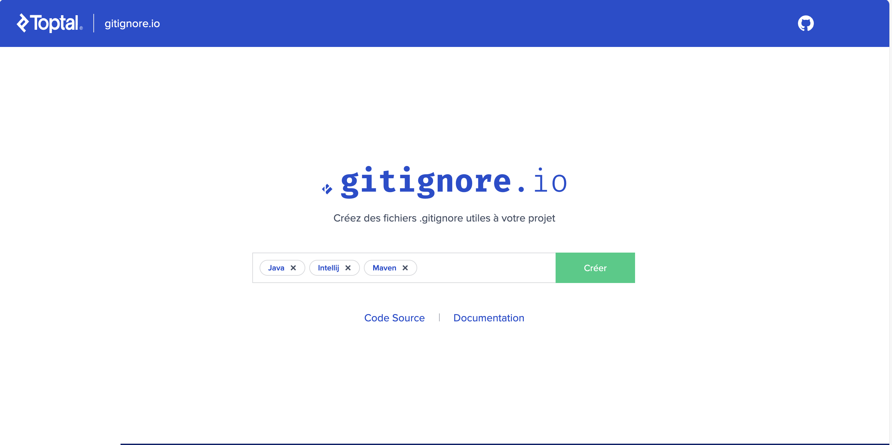

# Exercices - TP1

## Fichiers ignorés:
Nous avons utilisé l'outil gitignore.io de toptal qui permet de generer un fichier .gitignore  selon nos besoins d'element a ignoré a partir 
du langage du projet ,des frameworks utilisés ou de notre IDE.

source: getignore.io, https://www.toptal.com/developers/gitignore/

## Nommage de commit:

1-Notre équipe a décidé de suivre cette convention pour le nommage des commits, soit: 

type [optional scope]: description

[optional body]

[optional footer(s)]issues associé à la tâche.

Source: Convential commits, https://www.conventionalcommits.org/en/v1.0.0/

2- On "commit" lorsqu'une tâche associée à un issue est complétée. Autrement dit, la personne assignée à un issue "commit" le code fonctionnel relié à celui-ci. 

## Stratégie de branchage:

Dans le cadre de ce travail, nous avons choisi la stratégie GitHub flow.

1)La seule branche commune est celle du main. Le rôle du main est de contenir le code principal après le merge des autres branches.

2)La branche principale est le main!

3)Il peut exister plusieurs situations pour lesquelles une nouvelle branche peut être créée. Dans le cas de ce premier travail pratique, 
les branches ont été crée en fonction des différents membres qui ont participé à la réalisation du code, puisque cette pratique permettait à chacun de progresser sans interférer dans le travail d'un autre membre.
Une nouvelle branche a également été, dans certains cas, en fonction des nouveaux features, ou encore des issues!

4)Nous faisons une demande de pull Request, lorsq'un ou des issues sont résolus. Pour l'intégrer au code principal(dans le main), un autre membre doit vérifier et approuver les changements envoyés. Chaque membre envoit ses changements sur sa branche correspondante, selon l'issue résolu.

source: GitHub flow, https://githubflow.github.io

## Clean code (outil : Spotless)

documentation:https://github.com/diffplug/spotless

commande maven
- verifier  si le  formatage est correct :  mvn spotless:check
- appliquer le fix du formatage aux fichiers touché  :mvn spotless:apply

