# Exercices - TP2

Question 1: Le temps net maximal que notre équipe a pris pour implémenter une issue est de 10h. Le temps minimal est de 4h et le temps moyen tournait autour de 7h/8h.

Question 2: Le temps maximal que notre équipe a pris pour intégrer une pull-request a été d'1 semaine. En revanche, en moyenne, une pull-request nécessitait environ 24h avant d'être integrée. Le temps minimal a été de 30 min.

Question 3: Pour tous les issues, une seule personne y a été assignée. En revanche, en cas de besoin, on pouvait s'entraider entre membres. Le nombre maximal de personnes à s'entraider sur le même issue a été de 2.

Question 4: Généralement, une personne était nécessaire pour reviewer les pull-requests. Nous avons essayé de diversifier les reviewer à chaque pull-request. Toutefois, nous avons par moment eu 2 personnes qui ont commenté les pull-request afin de donner leurs rétroactions.

Question 5: Le nombre d'issues à être implémentés simultanément était très variable tout au long du livrable. En effet, ce nombre pouvait varier de 0(minimum) à 5(maximum). Toutefois, en moyenne, ce nombre tournait autour de 3 issues simultanément.

Question 6: Le nombre maximal de pull request a être évalués en même temps était de 3 pull-requests. Le nombre minimal quant à lui était de0. Ce qui faisait une moyenne d'environ 2 pull request a être évalués en même temps.

RÉFLEXIONS:
1- Selon nous, les issues/pull-requests prenaient un temps raisonnable à être terminées, entre le temps d'évaluation de correction et d'integration des commits. 
2- Forcément, plus les issues sont grandes et contiennet beaucoup de changements, plus le temps requis pour les terminer est grand. En effet, les grands issues impliquent parfois plus de modifications à corriger ce qui prolonge le temps d'intégration de ceux-ci.
3- Un des points à améliorer serait de diviser encore plus certains issues. Nous avons également remarqué que nous avions sous-estimé certains issues. Donc pour cela, nous comptons imposer des sous-échéanciers afin de s'assurer que le grand échéancier de dépot soit respectée.
    Finalement, un des derniers à améliorer serait d'unformiser le nom des branches, soit par numéro et description de l'issue. 

## Planification du travail

### Github Project
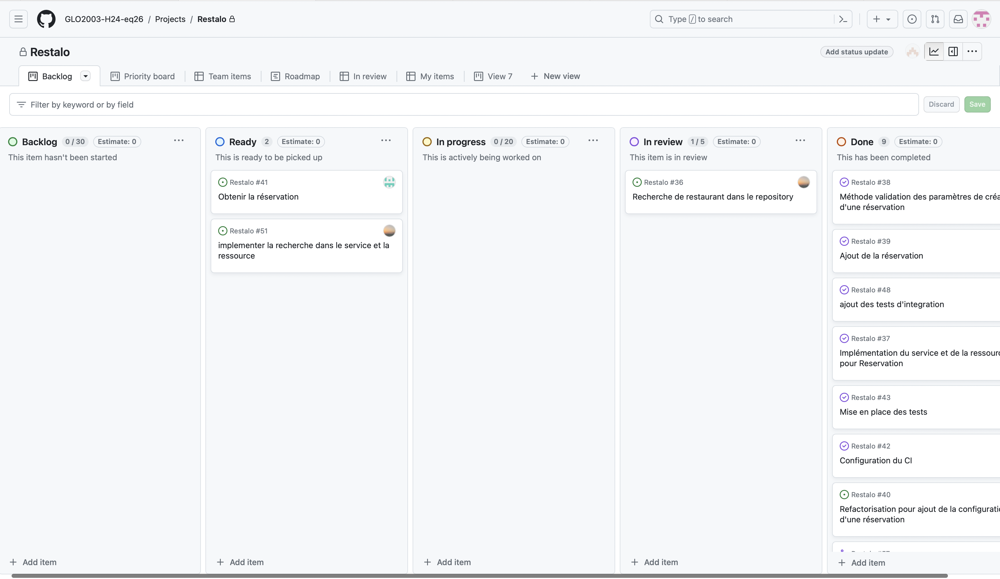

### Milestone
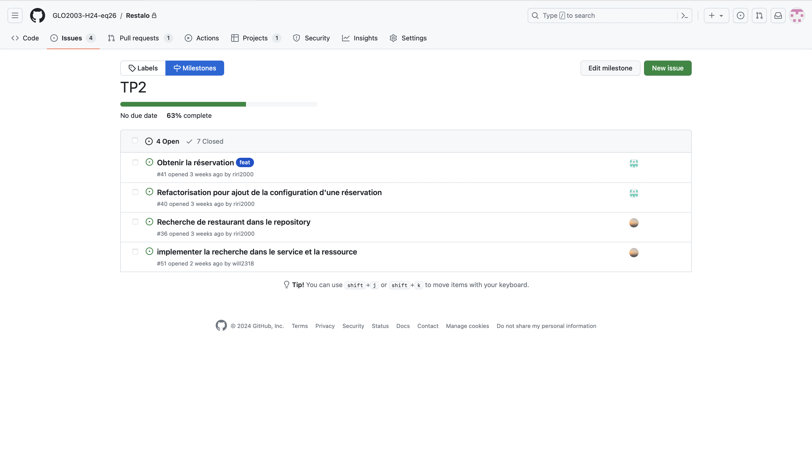

### Issues

  ### Issue1
  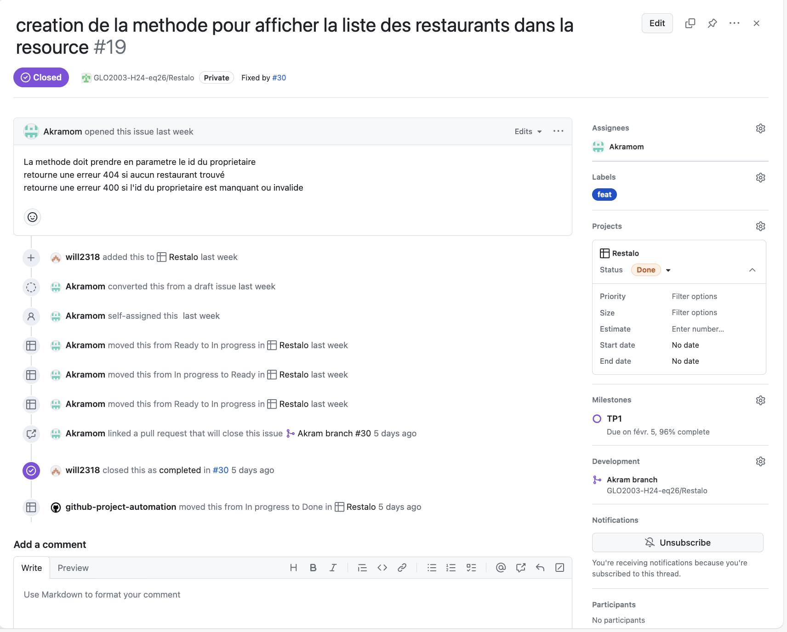
  
  
  ### Issue2
  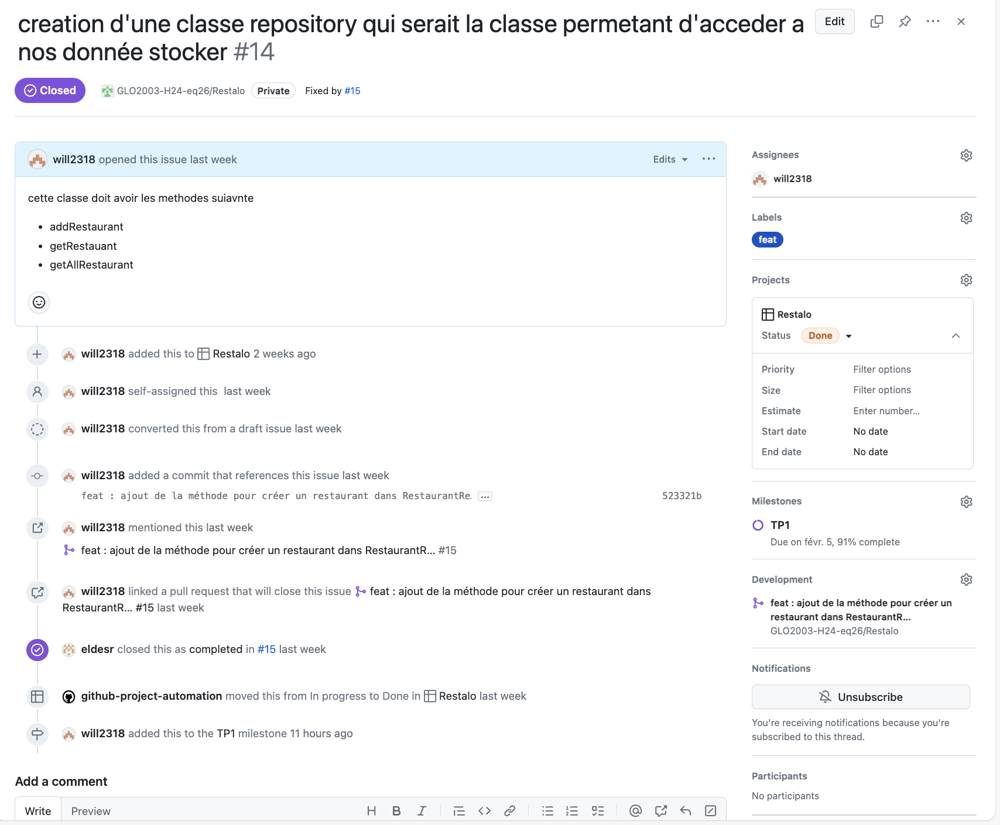
  
  ### Issue3
  

### Pull requests

  ### Pull request1
  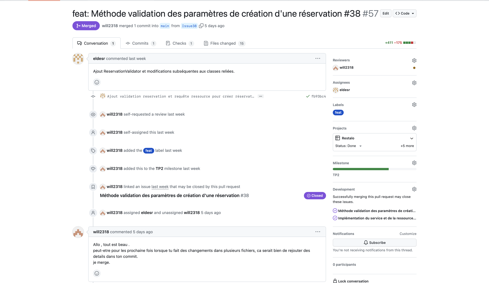
  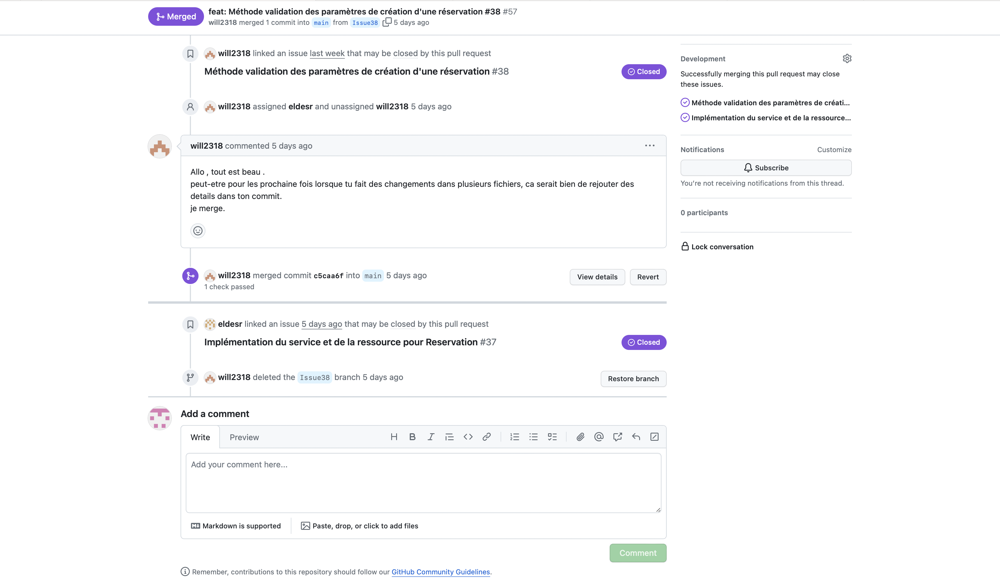
  
  ### Pull requests2
  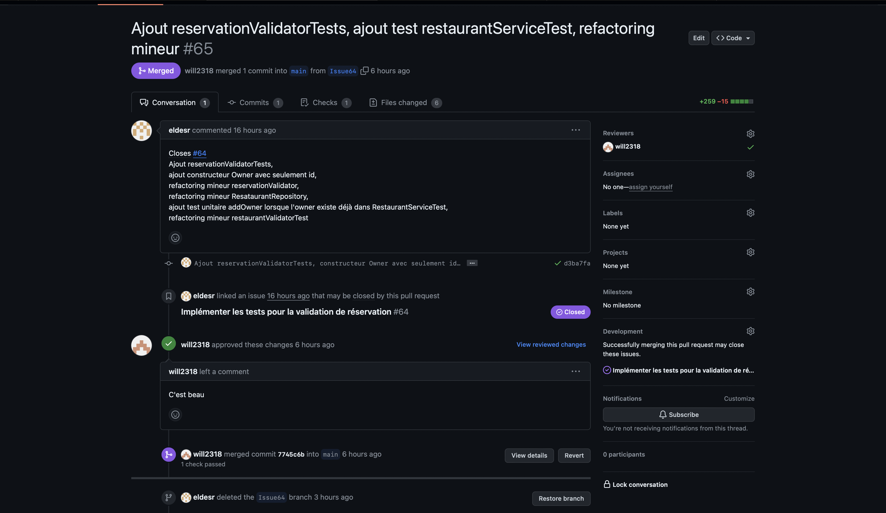
  
  ### Pull request3
  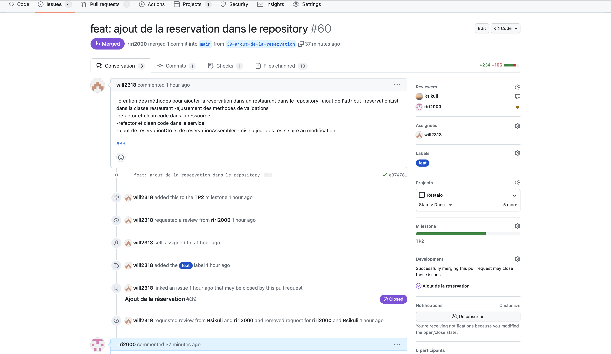
  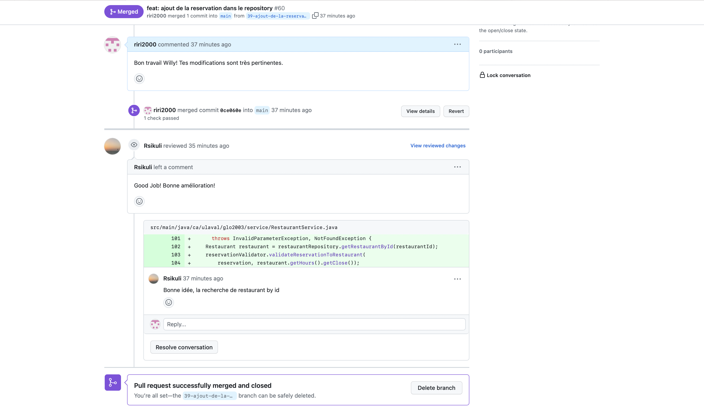

### Arbre de commits

### Architecture Restaurant
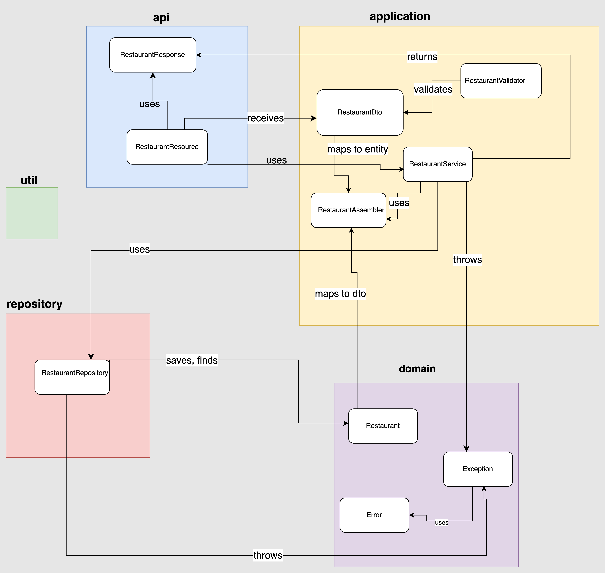

### Architecture Reservation
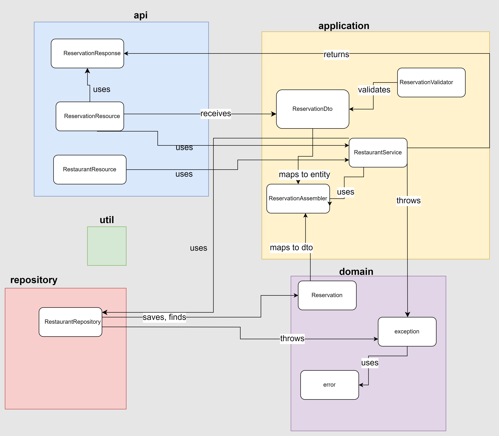

### Architecture Search

-Nous avons classes principales: RestaurantRepository, RestaurantService, ReservationResource, RestaurantResource, SearchResource, ReservationValidator et RestaurantValidator.
    La classe RestaurantRepository permet de fournir une interface pour interagir avec les données des restaurants et des propriétaires, y compris l'ajout, la recherche et la récupération d'informations.
    La classe RestaurantService agit comme une couche intermédiaire entre les contrôleurs de l'API et le dépôt de données.
    La classe ReservationResource est responsable de traiter les requêtes HTTP liées aux réservations.
    La classe RestaurantResource est responsable de traiter les requêtes HTTP liées aux restaurants et à leurs réservations.
    La classe SearchResource permet de fournir un point de terminaison pour effectuer des recherches de restaurants en fonction de critères spécifiques.
    La classe ReservationValidator est responsable de la validation des données de réservation pour s'assurer qu'elles respectent certaines règles et contraintes avant de les traiter ou de les enregistrer dans l'application.
    La classe RestaurantValidator a la même fonctionnalité que celle de reservation, mais concernant les données de restaurant.

Nous avons séparé comme suit afin de, premièrement, améliorer la cohérence et la maintenabilité du code, en plus de permettre la réutisilabilité des méthodes et d'ainsi éviter la redondance.

Finalement, un des points qui seraient à améliorer, serait de rajouter une autre classe RestaurantService, afin d'éviter qu'une seule classe, soit ReservationService, s'occupe de toutes les dépendances au service. 

