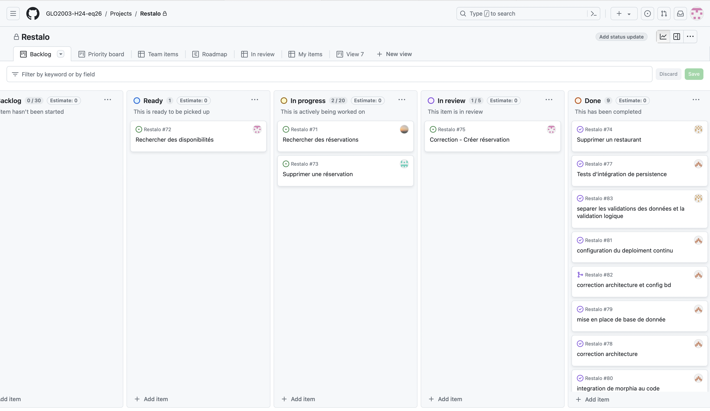
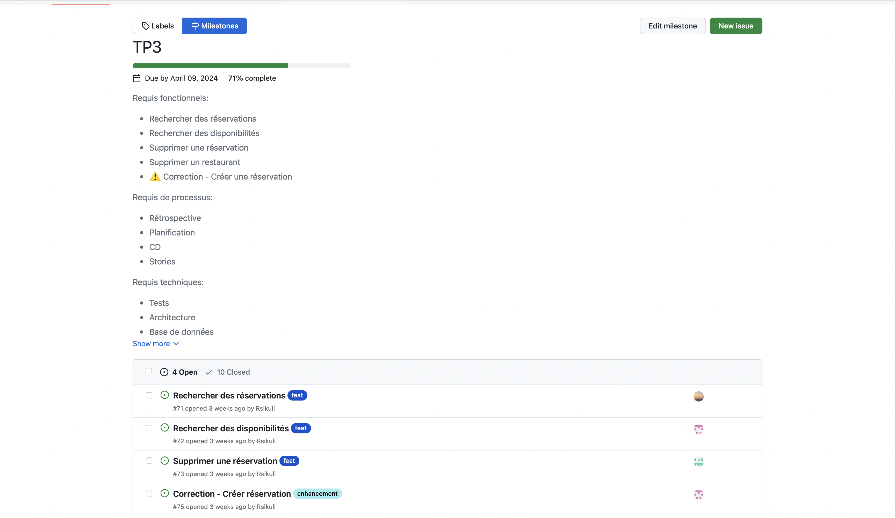
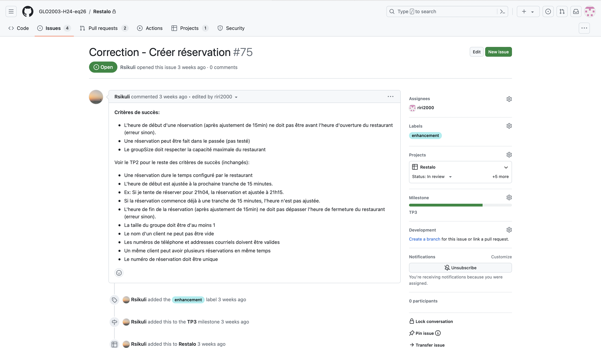
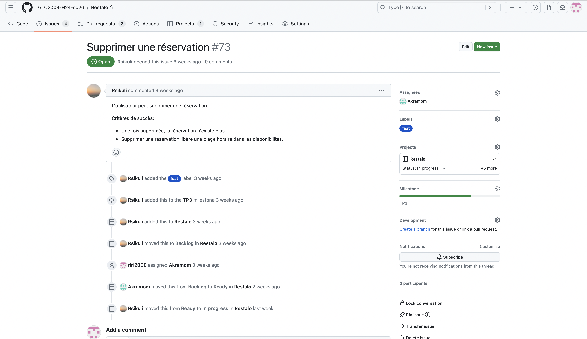
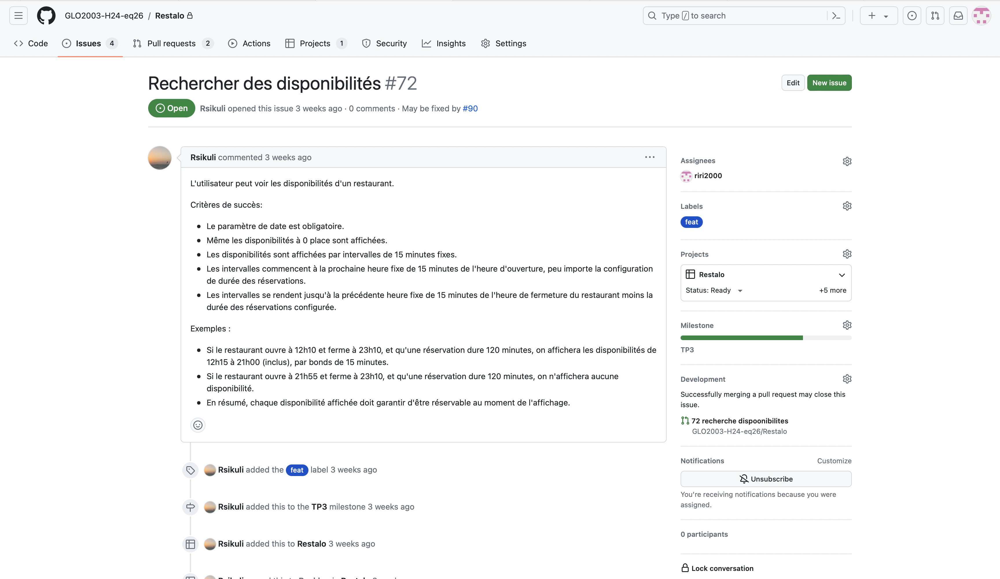
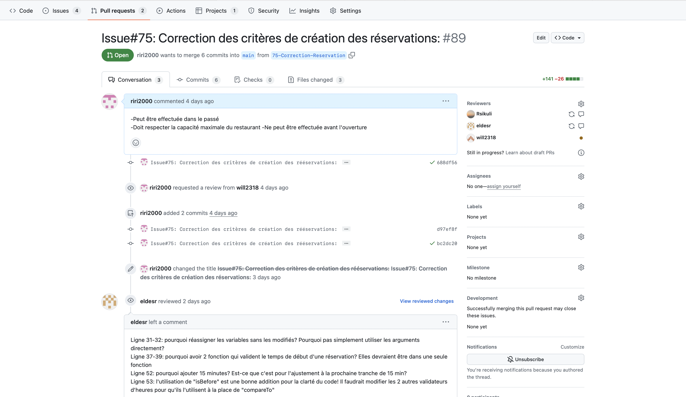
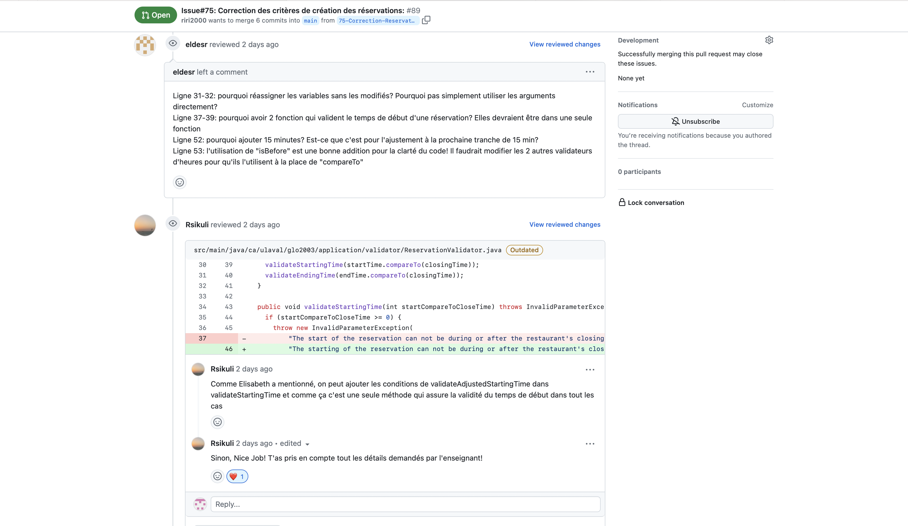
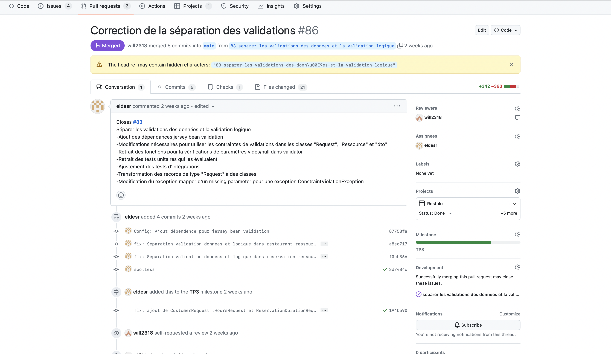
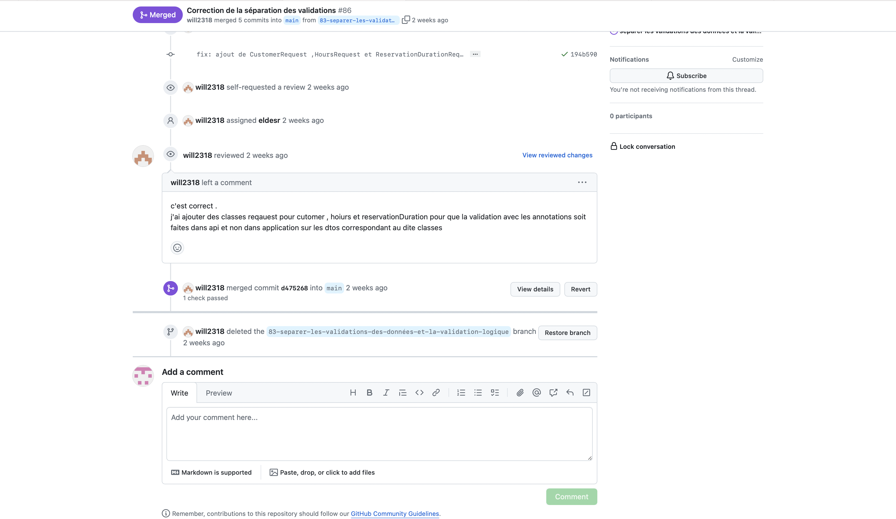
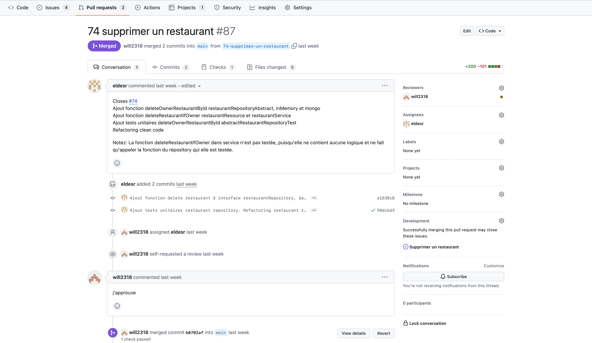

### Exercices - TP3

## Pipeline CI
1. Avant le pipeline, nous nous assurions que tout fonctionne correctement en testant manuellement le code quelques fois avant la remise. En générale, nous investissions environ 4h à tout vérifier de façon continue;
2. Après cette implémentation, le temps dedié aux tests a grandement diminué. Nous vérifions à chaque push que tout les tests automatisés s'Executent avec succès, mais l'opération nécessite quelques secondes seulement.
3. Le premier point positif qu cette impléentation nous a procuré est un gain de temps. Il nous a aussi permis de s'assurer que des erreurs humaines ou d'innatention soient automatiquement detectés donc la qualité du code est améliorée et finalement cela nous permet de réduire les conflits d'intégrations;
4. Puisque nous prenons pour acquis l'automatisation, cela peut mener à un excès de confiance en négligeant les tests manuels qui pourraient s'avérer pertinents dans certaines situations et donc ne plus détecter certaines erreurs.

## Tests
1. Cela dépend de chaque membre de l'équipe, mais de façon générale, nous avons investis environ 70% du temps à implémenter le code fonctionnel et 30% à confectionner les tests. Cette proportion n'a pas forcément évolué avec le temps, mais plutôt en fonction de la compléxité des méthodes.
2. Puisque nous avons décidé que chaque issue assigné à un membre implique également la confection de ses tests, la taille des issues et le temps qui lui a été accordé ont considérablement augmenté. Selon cette même logique, la vérification des PRs necessitait plus de temps et d'attention des membres.
3. Dans notre cas, avoir des tests unitaires nou a permis d'avoir plus confiance envers le code. En effet, puisque nous testions chaque méthode et sa fonctionnalité en courvrant tous les cas possibles, nous avions l'assurance d'avoir un résultat qui reflète ce qui est recherché.
4. Nous nous sommes aperçu que dans certains cas, les tests ne couvraient pas l'échelle des cas possibles, et donc certaines errreurs n'étaient pas détectées. Aussi, un manque d'uniformité entre les tests a pu être soulevé, problème qui a été résolu par la suite. Finalement, une autre piste d'amélioration serait de mieux structurer les tests.

### Planification

## Github Project
 

## Milestone
 

## Issues

# Issue1
  

# Issue2
  

# Issue3
  

## Pull requests

# Pull request1
  
  

# Pull requests2
  
  

# Pull request3
  

