# Exercices - TP4

# Restrospective finale 
## Processus

### 1. Décrivez 2 problématiques que possèdent votre processus et développez 2 plans distincts afin de les résoudres
1)Les tests: Une de nos principales problématiques est la couverture des tests. Nous nous sommes rendus que pas mal de tests manquaient et qu'on se retrouvait régulièrement avec des méthodes non testées. Une solution que l'équipe peut mettre en place est les TDD. Cela nous assurera une meilleure couverture.
2)Magic values: À chaque livrable, des magic values nous glissaient. En effet, une des mauvaises pratiques de l'équipe est d'utiliser des magic values. Pour résoudre ce problème, une bonne pratique à implanter individuellement est de refactoriser constamment nos parties avant chaque push afin de s'Assurer qu'aucune magic value n'ait glissé et les corriger au fur et à mesure. 

### 2. 
Afin d'intégrer de nouveaux outils, nous commencions par les recherches afin de comprendre comment l'intégrer ou choisir les bons outils selon nos besoins. Nous procédions ensuite à l'intégration. Lorsque la configuration se déroule bien, nous exécutions alors les tests et nous nous assurions que tout fonctionnait comme prévu. Cependant, en cas de problème, notamment dans l'intégration de Sentry. Celui-ci fonctionnait avec la persistence in Memory, mais pas sur Mongo. Afin de détecter ce problème, nous avons procédé avec des tests manuels.
Ce qui a été appris de cette démarche est que les tests unitaires sont toujours très importants à faire, malgré la présence des tests automatisés.

### 3. Quels sont les bons coups de votre équipe? De quelles parties êtes-vous fiers?
1)Le premier point positif de notre équipe est que nous sommes tous ouverts d'essayer les différents issues afin de diversifier notre apprentissage. Les membres étaient ouverts à sortir de leur zone de confort pour des fins d'apprentissage.
2)Nous sommes fiers de notre architecture. L'équipe a bien travaillé afin d'obtenir la meilleur architecture possible, en diminuant les problèmes de dépendances que nous avions aux premières remises.
3)Un autre point positif de notre travail est l'intégration CI puisqu'il fonctionne bien.

### 4. Quel conseil donneriez-vous aux prochains étudiants qui doivent faire ce projet?
Notre meilleur conseil pour les futurs étudiants, serait de s'impliquer dans toutes les parties du projet, puisque chaque partie nous permet d'apprendre de nouvelles compétences.

### 5. Quels apprentissages, trucs ou techniques appris dans ce projet croyez-vous pouvoir utiliser plus tard?
Ce projet nous a permis d'énormément apprendre dans la sphère technique. En effet, en sortant de ce cours et grâce à ce projet, on a appris faire du "bon" code au lieu d'un simple code qui fonctionne. La première bonne pratique est le clean code. En respectant les règles du clean code, on s'Assure d'avoir un code plus qualitatif. 
Deuxièmement, on a appris à avoir une bonne architecture de projet. En effet, c'était un de nos problèmes principaux aux premières remises et puis nous avons appris petit à petit à l'améliorer su fil des remises et des commentaires des correcteurs.

### Planification

## Github Project
 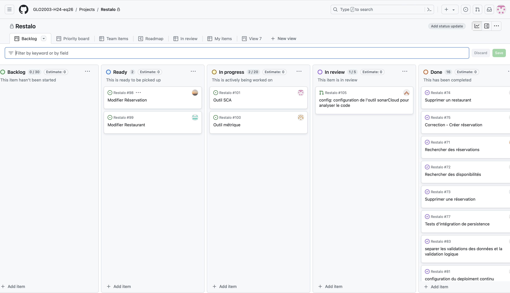

## Milestone
 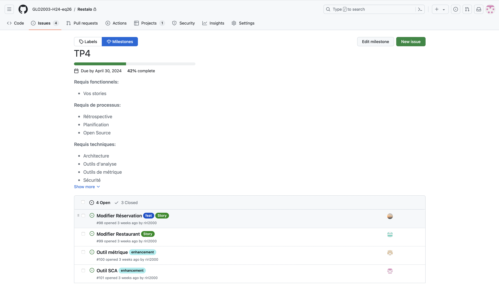

## Issues

# Issue1
  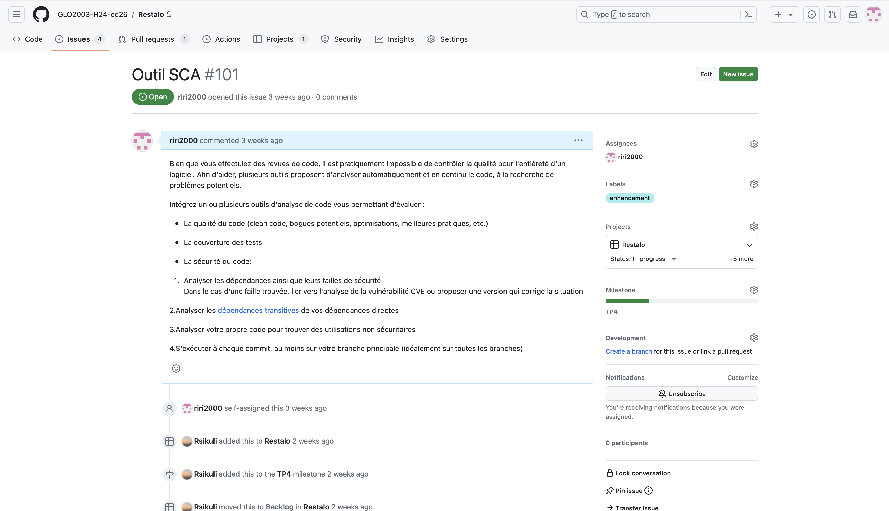

# Issue2
  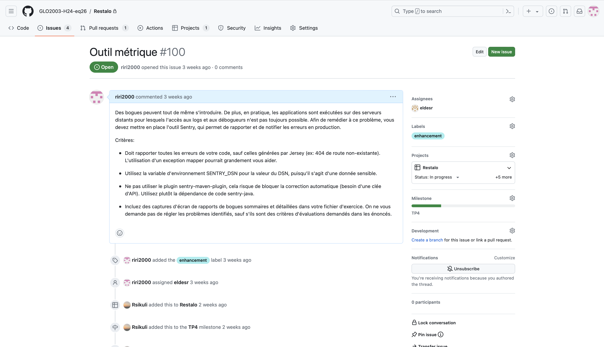

# Issue3
  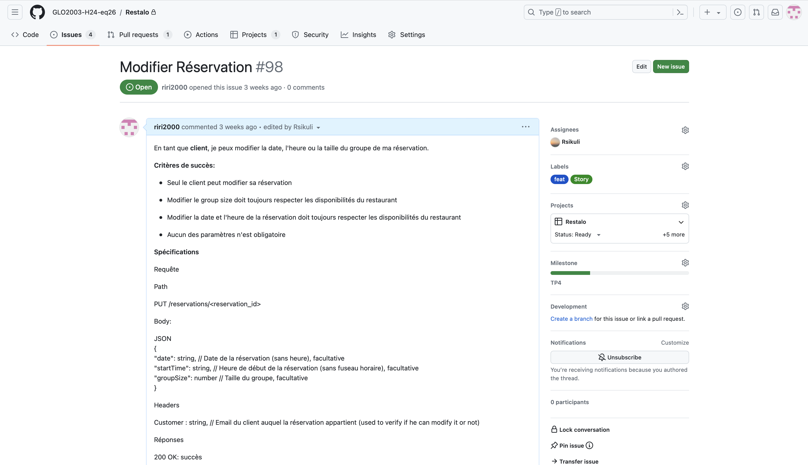
  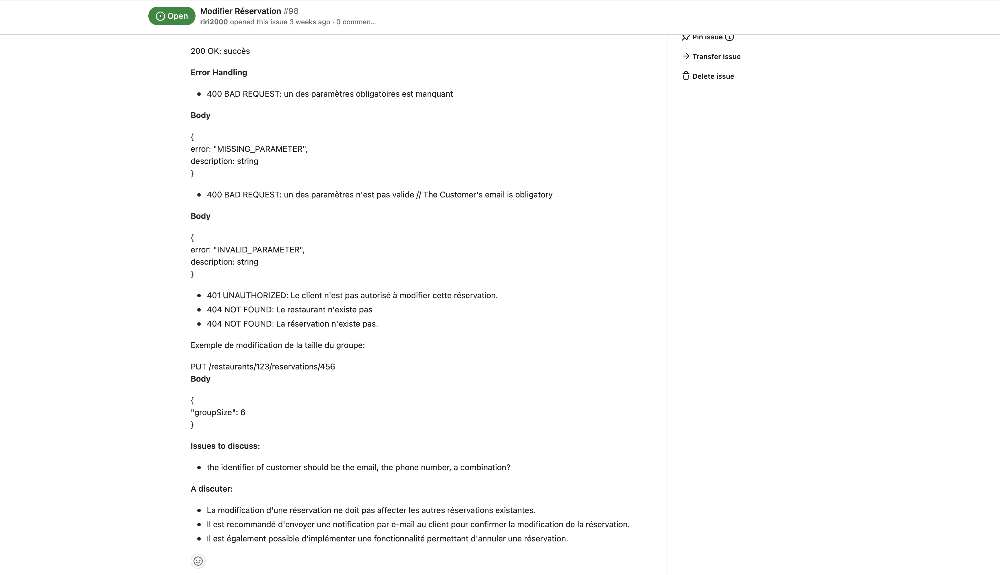

## Pull requests

# Pull request1
  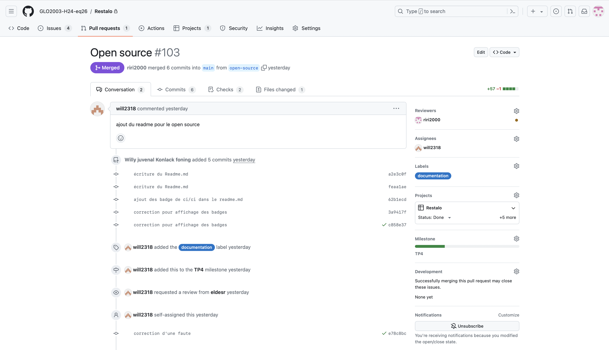
  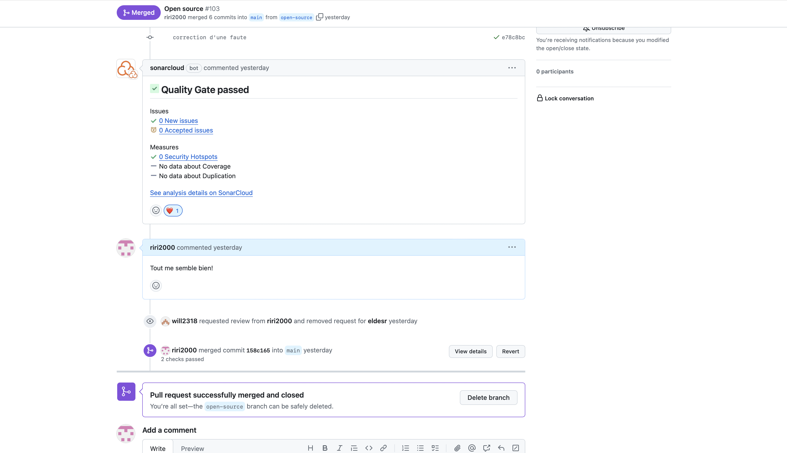

# Pull requests2
  
  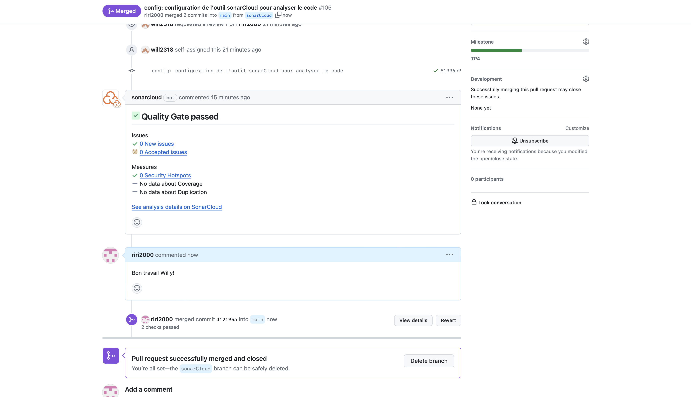

# Pull request3
  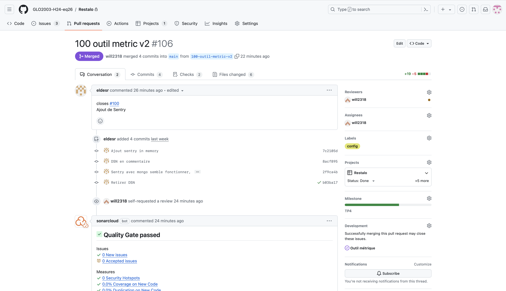
  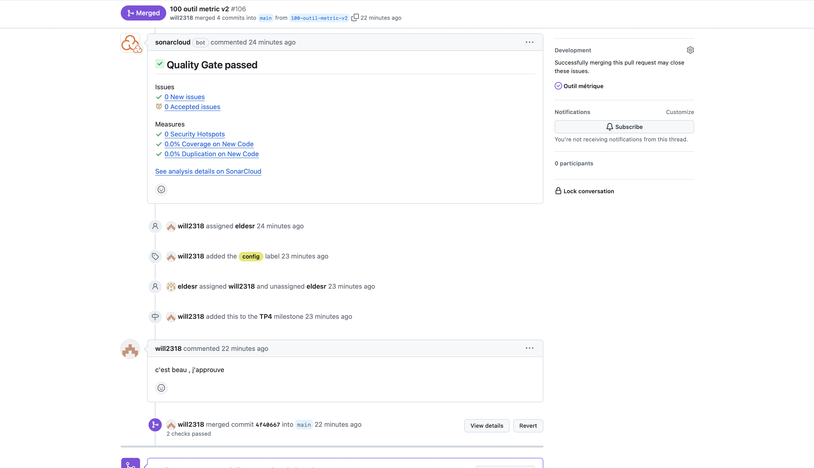

## Arbre des commits
  

# Outils d'intelligence artificielle

### 1. Avez-vous utilisé, dans le cadre du cours, du projet ou de façon personnelle, un outil d'intelligence artificielle (style ChatGPT) pour vous aider à programmer?
-Willy: J'ai utilisé Tabnine qui est un outil qui permet de générer automatiquement du code. Je l'ai notamment utilisé pour la génération de quelques tests unitaires. Il permet donc d'accélérer ce processus qui peut en temps normal, prendre pas mal de temps. De plus, je trouve, personnellement, qu'il est assez fiable pour ce type de tâches.
-Rihab: Pour ma part, ChatGPT m'a permis de comprendre certaines erreurs générées par l'IDE. J'ai également fait appel à lui pour la correction de certains tests qui ne passaient pas.
-Rami: j'ai utilisé les outils d'intelligence artificielle ChatGPT et Gemini pour m'aider à programmer dans le cadre du projet et du cours. Ces outils d'intelligence artificielle peuvent effectuer des révisions de qualité sur le code, identifier et expliquer les lois et les principes violés, ainsi que proposer des corrections. De plus, cela m'a permis d'approfondir mes connaissances et d'explorer de nouvelles idées pour l'implémentation des fonctionnalités. Dans le cadre du cours, cela m'a permis d'obtenir des explications plus détaillées et des exemples concrets pour mieux comprendre les concepts enseignés.
-Elizabeth: Non, je n'ai pas utilisé d'IA pour réaliser le projet. Personnellement, j'ai quelques problèmes éthiques et moraux avec l'IA, alors je préfère ne pas l'utiliser à moins d'être forcée. 
-Akram: 

### 2. Quel est le principal avantage qu'offre une telle technologie?
Les technologies d'intelligence artificielle peuvent être un bon appui pour certaines tâches faciles qui ne nécessitent pas un haut niveau de reflexion et qui sont plutôt "machinales". Elles permettent donc un certain gain de temps dans certaines circonstances.

### 3. Quel sont les désavantages potentiels d'utiliser une telle technologie?
Utiliser ces outils d'intelligence artificielle peuvent s'avérer dangeureuses puisqu'une dépendance à ce type d'outils crée une paresse intelectuelle. En effet, se tourner vers ChatGpt, par exemple pour résoudre le moindre problème auquel on fait fasse, crée une dépendance et donc cela fait perdre le réflèxe et la capacité de réfléchir à leur résolution.
Ce type de technologie peut également induire en erreur dans beaucoup de situations. Il ne faut donc pas prendre ce qu'il propose à la lettre sans l'analyser ou le remettre en question. Leur utilisation nécessite une bonne maitrise du sujet auquel on fait appel ces intelligences artificielles.

### 4. Selon vous, aurons-nous toujours besoin de spécialistes en développement logiciel malgré cette technologie?
Oui! Puisque les intelligences artificielles telles que nous les connaissons aujourd'hui ont tout de même des limites, nous aurons toujours besoins de spécialistes pour couvrir ces cas limites et s'assurer de la progression et l'amélioration de ces outils. Néanmoins, l'intelligence artificielle pourra remplacer sans problème les spécialités plus mécaniques et nécessitant un faible niveau intellectuel.

# open sourcing

## 3 avantage a contribuer a des projets open source en tant que entreprise

### 1. Amélioration des produits et services
En contribuant à des projets open source, les entreprises peuvent bénéficier des connaissances et de l'expertise d'une communauté mondiale de développeurs. Cela peut les aider à identifier des problèmes et des solutions qu'ils n'auraient peut-être pas pu trouver seuls

### 2.  Renforcement de la marque et de la réputation
D'une part ,La contribution à l'open source est considérée comme une pratique positive par de nombreux consommateurs et partenaires. Cela peut aider les entreprises à renforcer leur image de marque et à se positionner comme des leaders de l'innovation.
d'autre part Les meilleurs développeurs sont souvent attirés par les entreprises qui s'engagent dans l'open source. Cela peut aider les entreprises à recruter et à retenir les meilleurs talents.

### 3. Accès à des technologies et à des innovations de pointe

Les entreprises peuvent découvrir de nouvelles technologies et innovations en participant à des projets open source. Cela peut les aider à rester à l'avant-garde de leur secteur et à développer de nouveaux produits et services.
Aussi En s'appuyant sur des technologies open source, les entreprises peuvent réduire leurs coûts de recherche et développement. Cela peut leur permettre de libérer des ressources pour d'autres initiatives stratégiques.

##  3 défis qu'impose la mise en place d'un projet open source

### 1. Gestion de la communauté
#### Engagement des contributeurs : 
Il peut être difficile d'attirer et de retenir des contributeurs pour un projet open source. Cela nécessite une communication efficace et une gestion proactive de la communauté.
#### Résolution des conflits : 
Des conflits peuvent survenir entre les contributeurs d'un projet open source. Les mainteneurs du projet doivent être capables de résoudre ces conflits de manière juste et équitable.
### 2. Protection de la propriété intellectuelle
#### Licences ouvertes : 
Les projets open source sont généralement publiés sous des licences ouvertes, ce qui signifie que le code est librement accessible à tous. Cela peut poser des problèmes aux entreprises qui souhaitent protéger leur propriété intellectuelle.
#### Gestion des licences tierces : 
Les projets open source peuvent dépendre de bibliothèques et d'outils tiers qui sont également sous des licences ouvertes. Les entreprises doivent s'assurer qu'elles comprennent et respectent les conditions de ces licences.

### 3. Définir une stratégie claire du projet
#### Déterminer les objectifs du projet : 
Il est important de définir clairement les objectifs d'un projet open source avant de le lancer. Cela aidera à guider les décisions de conception et de développement.
#### Définir une feuille de route : 
Il est important de définir une feuille de route pour un projet open source. Cela aidera à garder le projet sur la bonne voie et à atteindre ses objectifs.

## information surprenante a porpos de l'open source

**L'open source n'est pas seulement une question de code.**

En effet, si le code open source est au cœur de la philosophie open source, ses principes s'appliquent bien au-delà du développement logiciel.
L'open source encourage la collaboration, la transparence, le partage des connaissances et l'innovation dans de nombreux domaines, tels que :
la science ou l'education.

##  Contribution externe

###  3 raisons d'utiliser  une licence MIT
1) Simplicité et facilité d'utilisation:

La licence MIT est l'une des licences open source les plus simples et les plus faciles à comprendre. Elle est rédigée en un langage clair et concis, ce qui la rend accessible aux développeurs de tous niveaux d'expérience.
La licence MIT contient peu de conditions et d'obligations, ce qui la rend facile à mettre en œuvre et à respecter. Cela peut être particulièrement important pour les petits projets ou les projets avec des ressources limitées.

2) Permissivité et compatibilité commerciale:
s
La licence MIT est l'une des licences open source les plus simples et les plus faciles à comprendre. Elle est rédigée en un langage clair et concis, ce qui la rend accessible aux développeurs de tous niveaux d'expérience.

3) Large adoption et reconnaissance de la communauté:

La licence MIT est l'une des licences open source les plus populaires et les plus largement adoptées. Elle est utilisée par des milliers de projets open source, y compris des projets très populaires tels que jQuery, Rails et Node.js.
Cette large adoption signifie que les développeurs sont familiers avec la licence MIT et savent comment l'utiliser.

###  code de conduite

Le code de conduite du projet est basé sur le template de Mozilla https://wiki.mozilla.org/Code_of_Conduct/Draft

ce template a été choisi car il est clair, concis , facille a utilisé et adapter au projet open source de toiutes tailles.
en effet il est largement utilisé et respecte dans la communauté open source.aussi il est personnalisable et peut etre facilement adapté aux besoins specifiques de notre projet

###  fichier de contribution

Le fichier de contribution du projet sur un template generer grace au generateur [Contributing Gen](https://generator.contributing.md/)
que nous avons personnalisé en ajoutant les sections principes fondamentaux, meilleures pratiques de développement et une convention de nommage de branche afin de decrire  les meilleures pratiques de collaboration et de développement que vous voulez encourager au sein du projet

Ce generateur a été choisi car il permet de créer rapidement et facilement un fichier CONTRIBUTING.md complet et personnalisé, en répondant à des questions simples sur le projet. 
il utilise des modèles et des meilleures pratiques éprouvés pour garantir que le fichier CONTRIBUTING.md est clair, concis et informatif.

### SonarCloud
Voir les images ci-dessous afin de l'analyse de SonarCloud et des problèmes soulevés:
 
 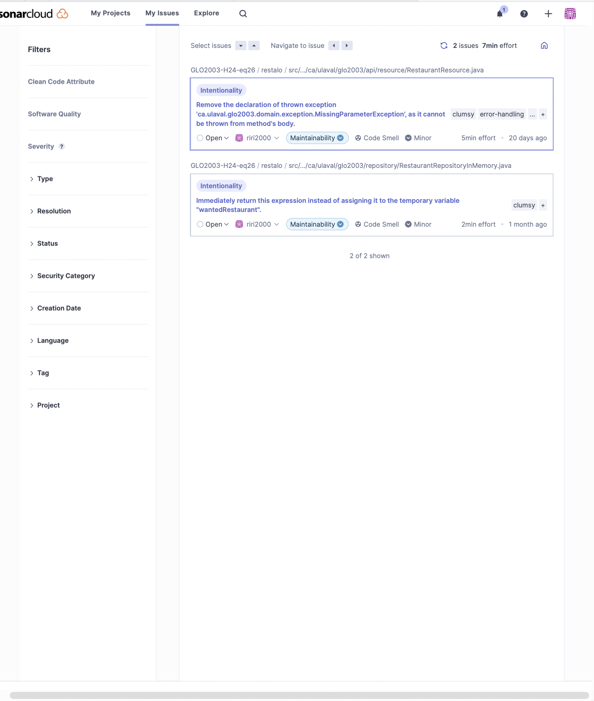
 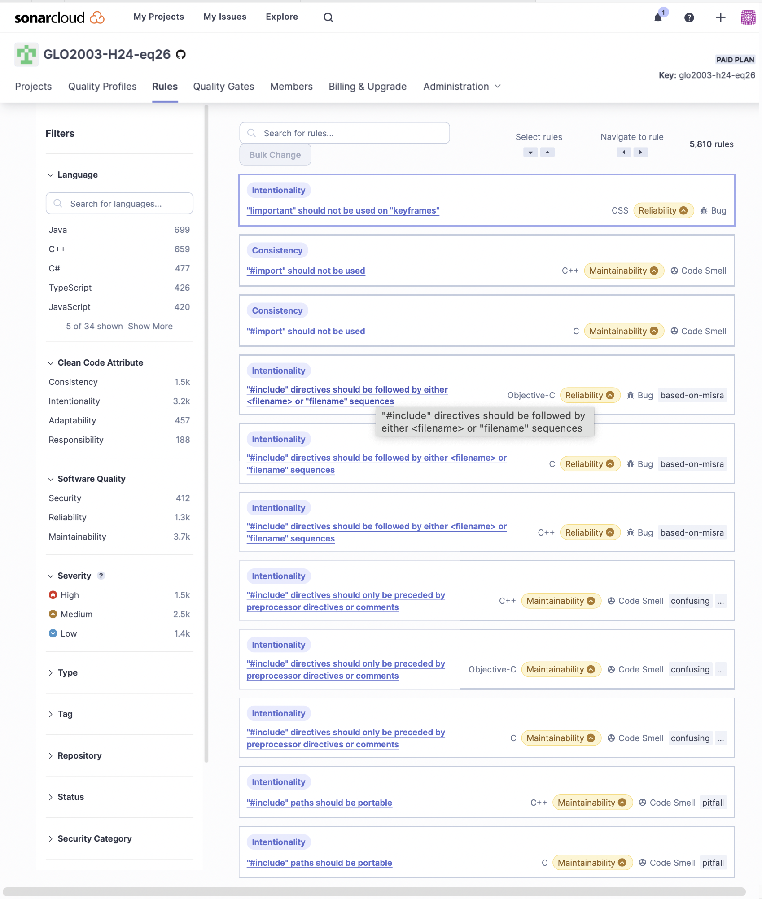
 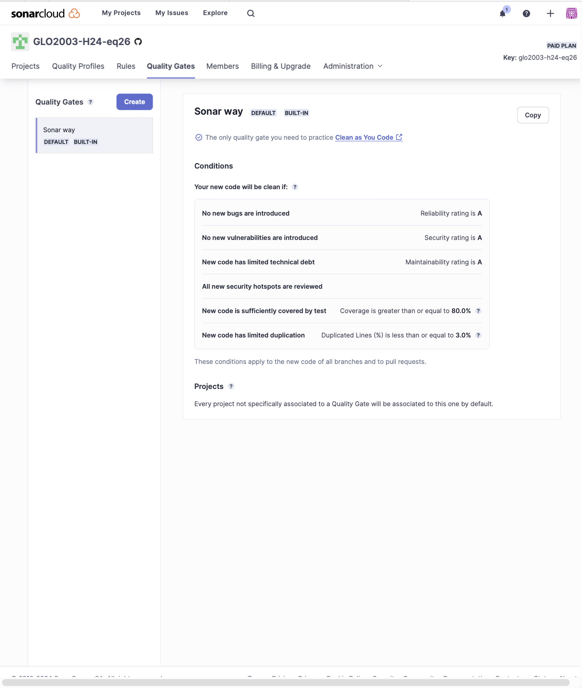
 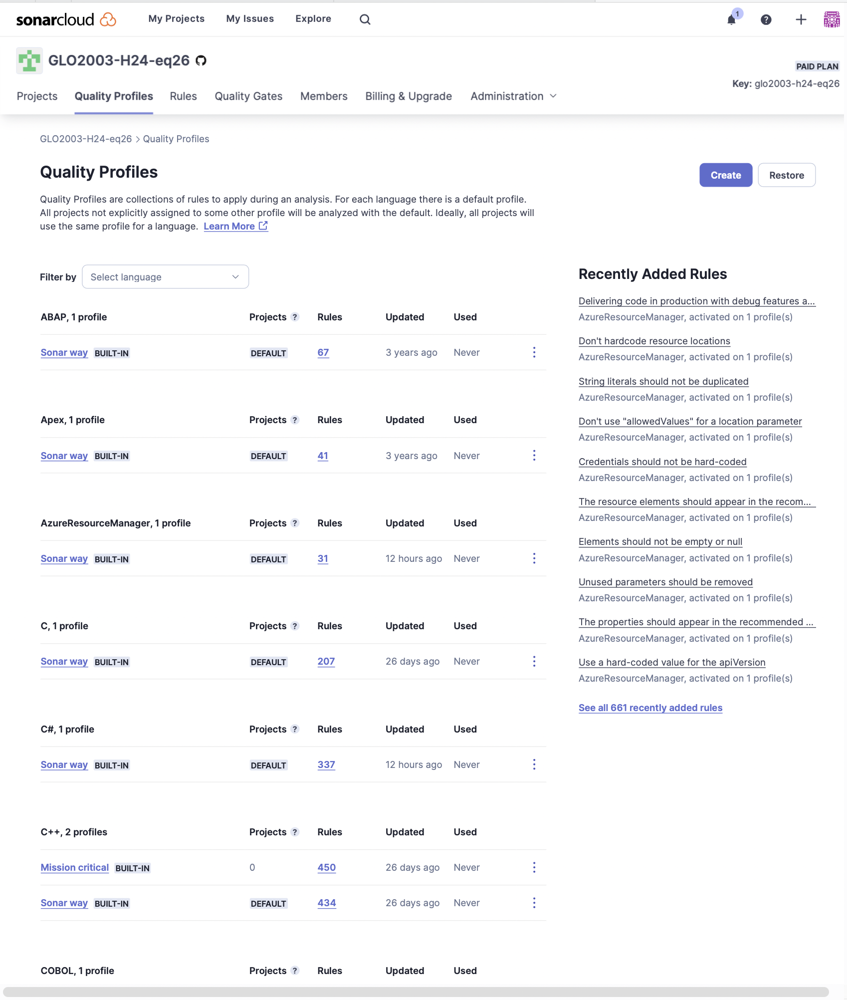

### Sentry 
Voir les images ci-dessous de l'analyse et des problèmes identifiés par Sentry:

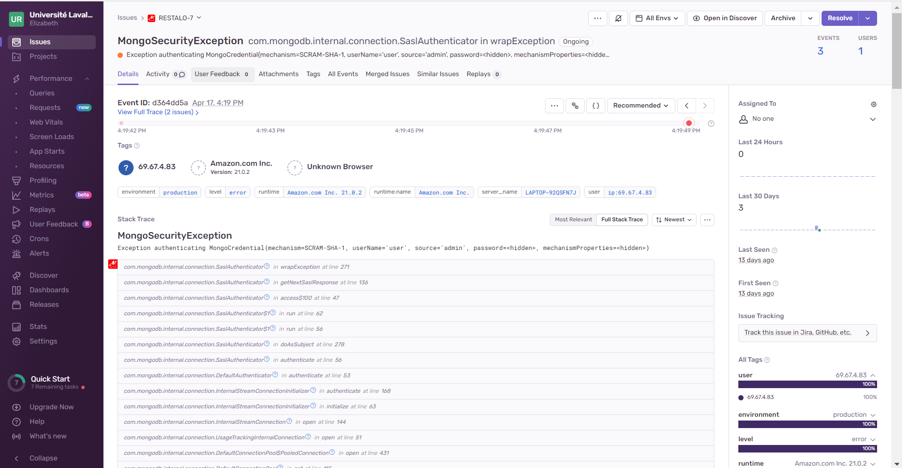

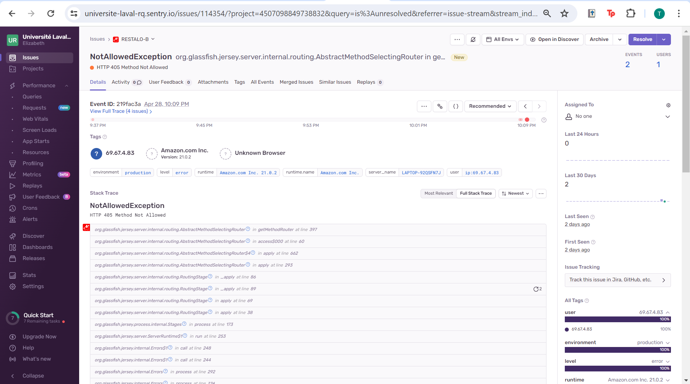

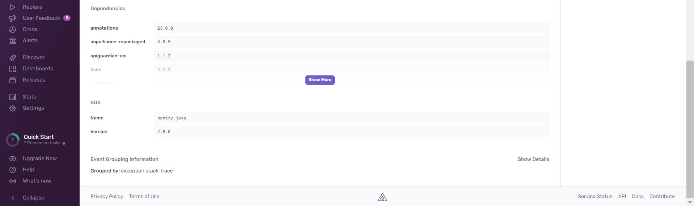

